

## Отчет

## Практическая работа 2 [HomeP]

## Основы XML-разметки. Менеджеры размещения LinearLayout и GridLayout

---

**ФИО:** Лапшин Никита Евгеньевич  
**Курс:** 2
**Группа:** ИНС-б-о-24-1  
**Направление:** 09.03.02 «Информационные системы и технологии»  

---
### Вариант 9
### Цель работы

Изучить основы языка разметки XML для описания пользовательского интерфейса Android-приложений. Научиться использовать менеджеры размещения (контейнеры) LinearLayout и GridLayout для создания сложных экранов. Освоить основные атрибуты View и создание простых Drawable-ресурсов.

### Ход работы

## Задание 1. Создание проекта и подготовка ресурсов

  
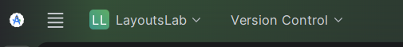

Рисунок 1 - Новый проект "LayoutsLab"

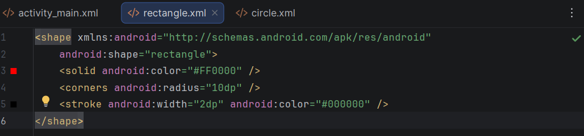

Рисунок 2 – Создание файла “rectangle.xml”

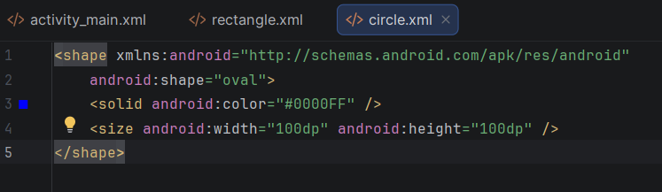

Рисунок 3 – Создание файла circle.xml

## Задание 2. Работа с LinearLayout

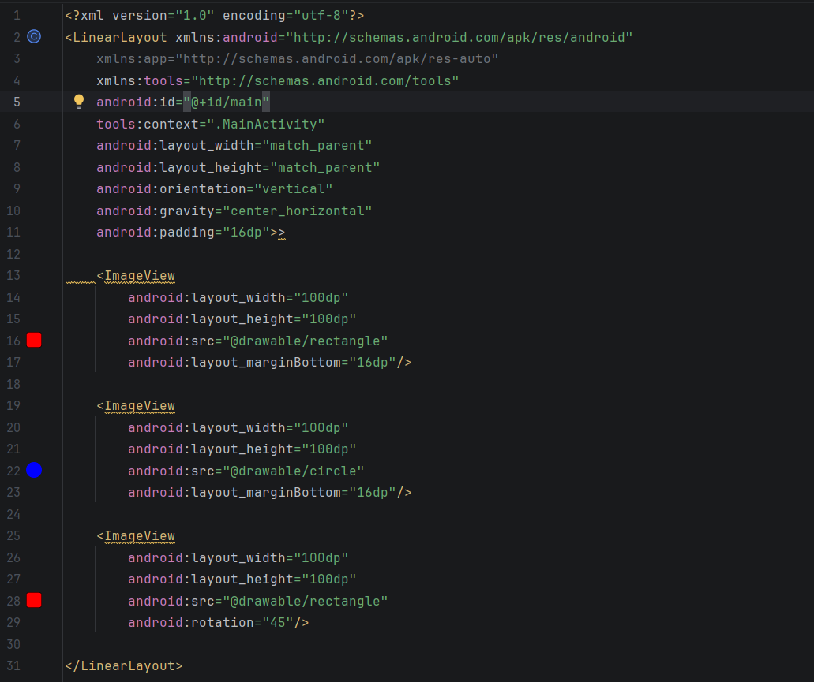

Рисунок 4 – Создание вертикального LinearLayout с тремя ImageView

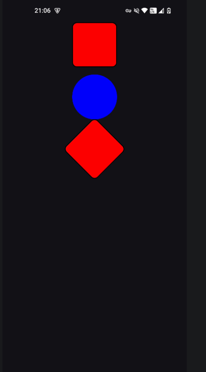

Рисунок 5 – Вывод кода на экран

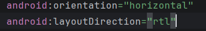

Рисунок 6 – Изменение и добавление атрибутов

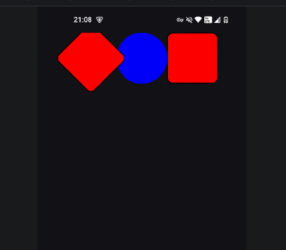

Рисунок 7 – Итог изменений в коде

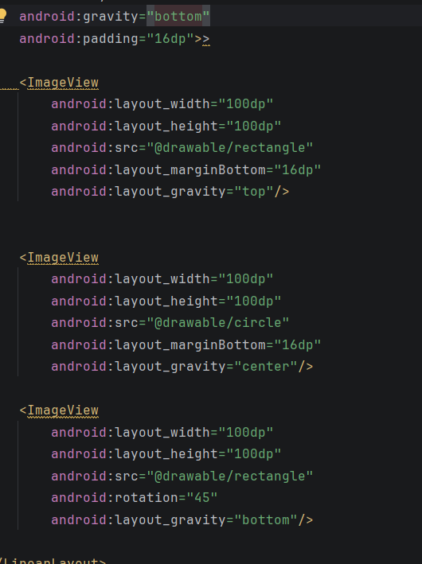

Рисунок 8 – Использование “android:gravity”

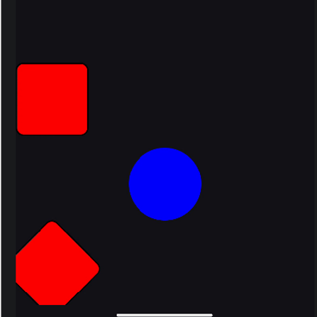

Рисунок 9 – Результат применения “android:gravity”

## Задание 4. Работа с GridLayout

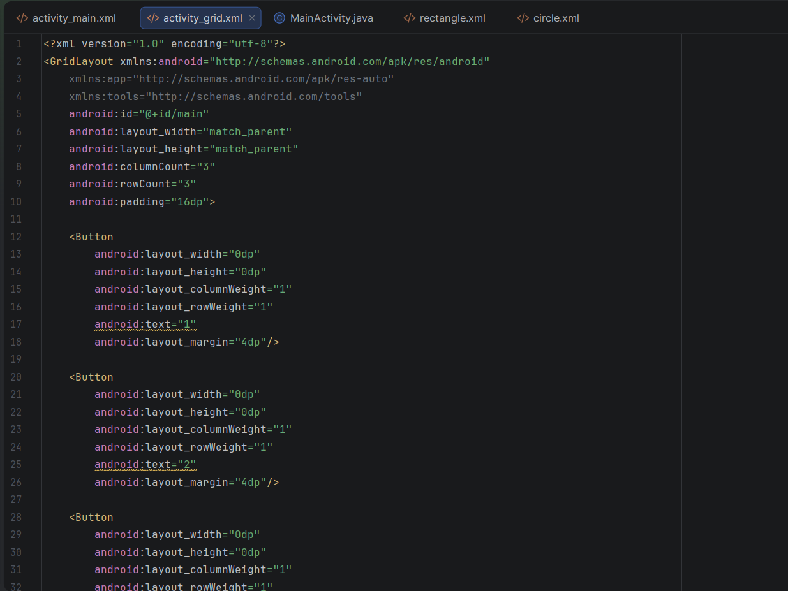

Рисунок 10 – Создание таблицы кнопок при помощи “GridLayout”

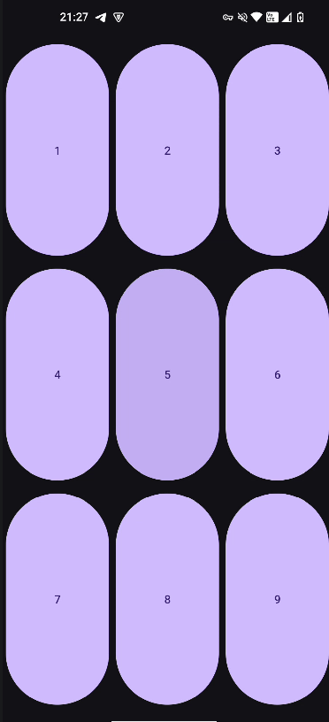

Рисунок 11 – Результат выполнения кода

## Задание 5. Объединение ячеек в GridLayout

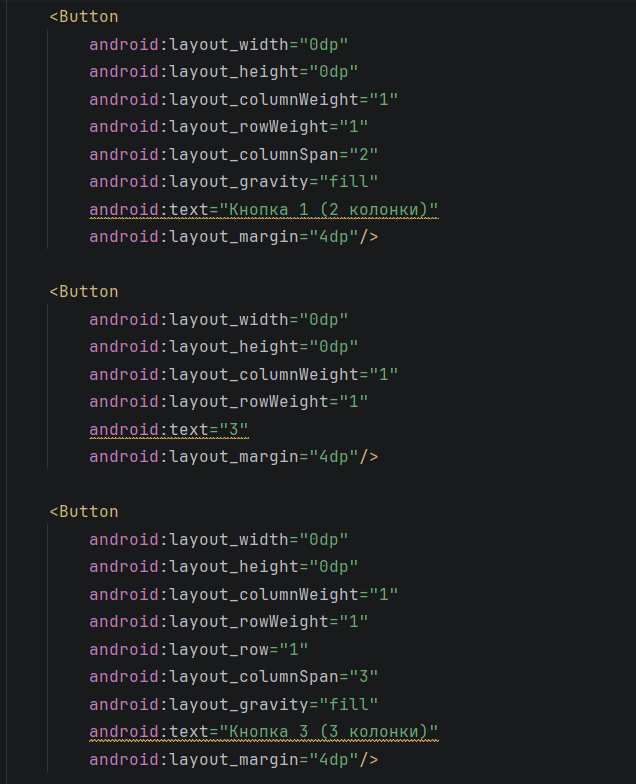

Рисунок 12 – Редактирование ячеек

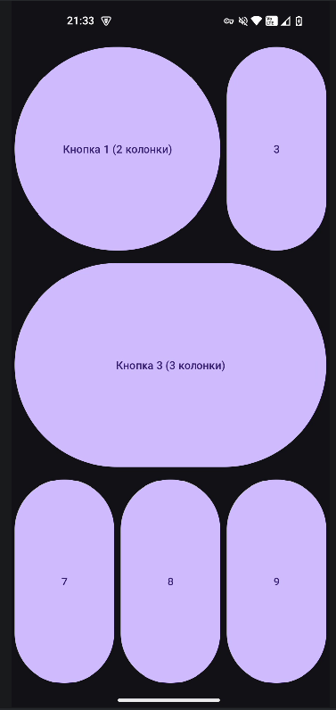

Рисунок 13 – Результат редактирования ячеек

## Индивидуальное задание. С помощью менеджеров размещения выведите букву П из кнопок на весь экран.

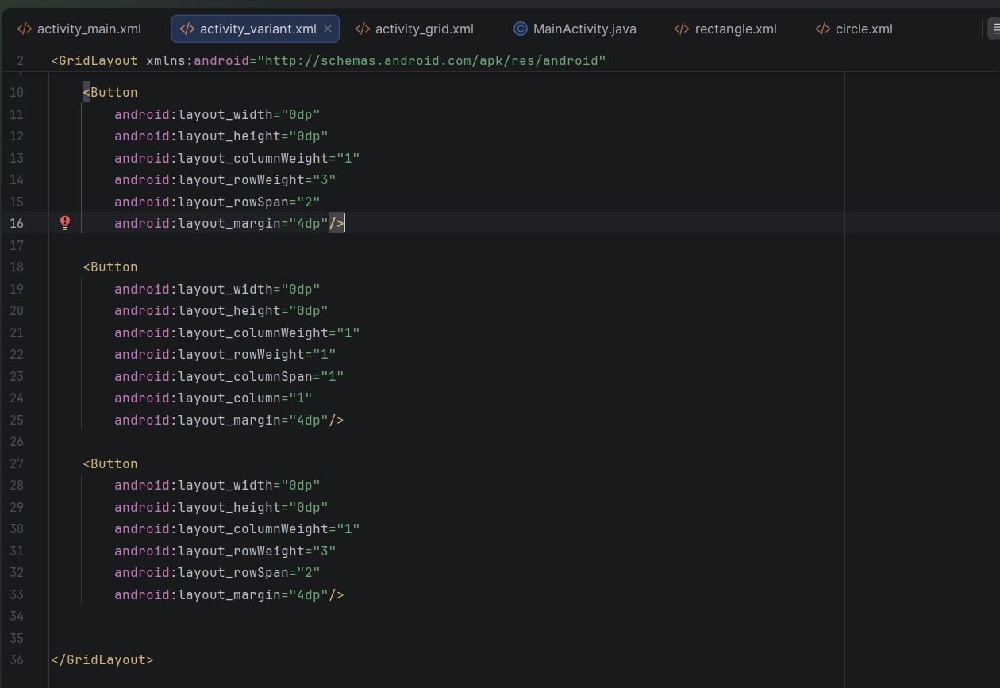

Рисунок 14 – Код для выполнения индивидуального задания

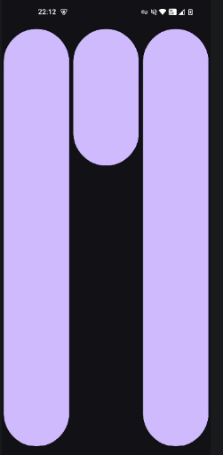

Рисунок 15 – Результат выполнения кода

## Вывод: 
В ходе выполнения работы были изучены основы языка разметки XML для описания пользовательского интерфейса Android-приложений. Рассмотрены менеджеры размещения LinearLayout и GridLayout, их особенности и области применения. Освоены основные атрибуты View, такие как layout_width, layout_height, gravity и layout_gravity, а также единицы измерения dp и sp. Получены навыки создания простых графических фигур с помощью XML-ресурсов в папке drawable. В результате работа позволила сформировать практические умения по верстке сложных экранов и эффективному использованию контейнеров для построения адаптивных интерфейсов.

## Контрольные вопросы:
1.	XML – это язык разметки для хранения данных, который используется для верстки экранов (layout), ресурсов (строки, цвета), меню и описания графики (drawable).
2.	Тег – это структурная единица XML. Состоит из открывающего тега, атрибутов, содержимого (опционально) и закрывающего тега.
3.	Менеджеры размещения - LinearLayout (в линию), RelativeLayout (относительно друг друга), FrameLayout (слои), ConstraintLayout (гибкий с констрейнтами), GridLayout (таблица).
4.	LinearLayout vs GridLayout - первый строит строго в линию (списки), второй - в таблицу (клавиатуры)
5.	Match_parent - на всю ширину/высоту родителя, wrap_content - по содержимому.
6.	android:gravity - выравнивание внутри элемента, android:layout_gravity - выравнивание в родителе.
7.	Единицы измерения: dp - для размеров (независимо от плотности), sp - только для текста (масштабируется шрифтом).
8.	Фигура в drawable - XML-файл с тегом <shape>, где shape="rectangle" - прямоугольник, shape="oval" - круг (при равных width/height), цвет задается <solid>, углы - <corners>.
